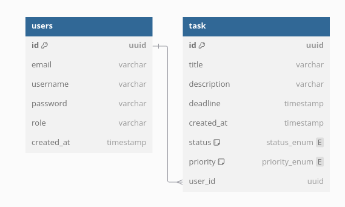

# ES-Individual-Project

## 1. Notes:
* **Jira** [Backlog](https://es-ip-2425.atlassian.net/jira/software/projects/EIT/boards/2/backlog)
* **Demo** [Video]()

## 2. Description:
- **Product Concept:**
    - To-Do List App Project, complying with Agile Software development and AWS cloud deployment

- **Documentation at Github:** 
  - [Sprints](https://github.com/Miragaia/ES-Individual-Project/tree/dev/docs/Sprints)
  - [Epics](https://github.com/Miragaia/ES-Individual-Project/tree/dev/docs/Sprints)
    - **Note:** Inside each Epic there is the User Stories Documentation

## 3. Architecture

  

## 4. Data Modelation

  

## 5. Repository Organization:

## 6. API Documentation

- [**Swagger**]()

## 7. Definition of Ready
| Defiinition of Ready|
|:---:|
| Formatted as "As a (...), I want (...) so that (...)" |
| Short and self-explanatory |
| Defined story point, with a maximum of 3-5 |
| Acceptance criteria as "Given (...) when (...) then (...)" |
| INVEST methodology |
| Estimated priority, given by the position in the backlog |

## 8. Definition of Done
| Defiinition of Done|
|:---:|
| Developed |
| Documented |
| Compliant with Acceptance Criteria |
| Merged into central branch ("dev") |
